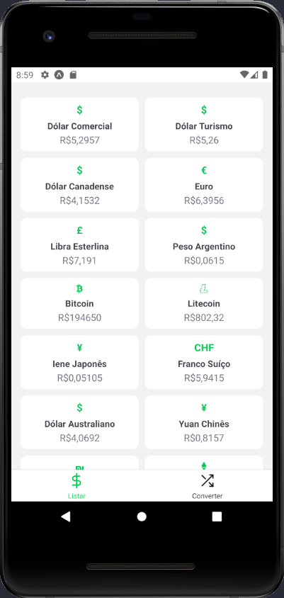
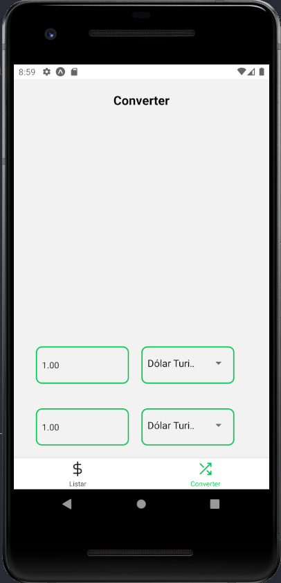
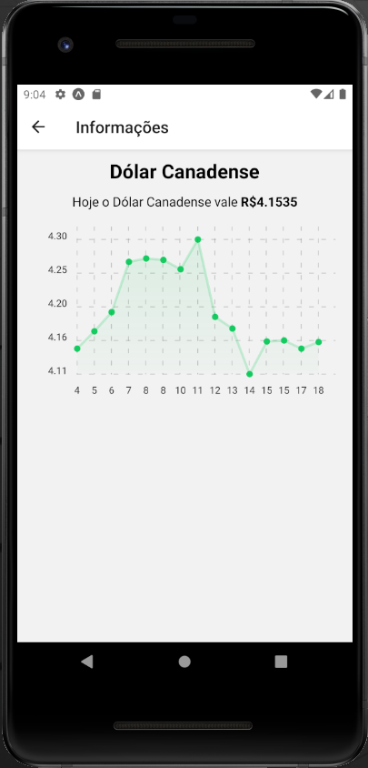

### Projeto desenvolvido a fim de aprender sobre React Native
Tecnologias utilizadas:
- React Native
- Expo

## Projeto
<b>Dinheiro Agora</b> lista os valores em tempo real das moedas mais utilizadas no mercado.
 
Ele também entrega um grafico de suas variações de valor.

### Telas

Listar             |  Converter            |  Informações 
:-------------------------:|:-------------------------:|:-------------------------:
 |   |  
